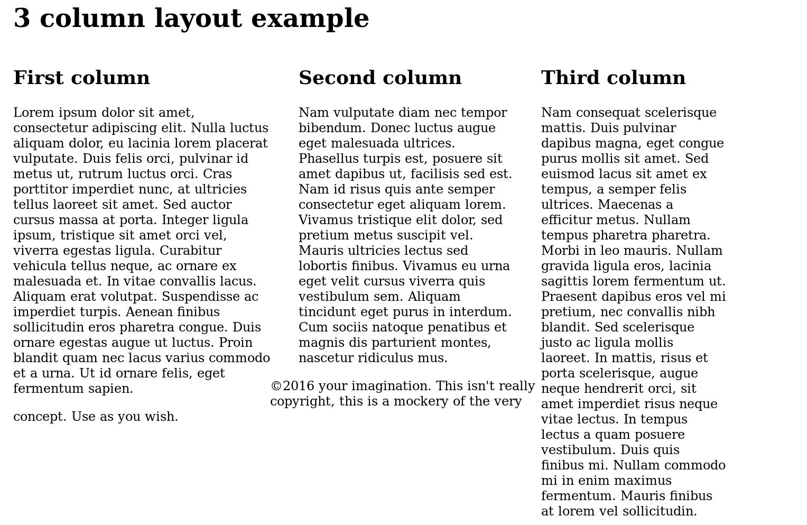

前端笔记

[TOC]

# html

# css

## 应用css

外联样式

```html
<link rel="stylesheet" type="text/css" href="style.css">```
```

内联样式

```html
<style type="text/css">
</style>
```

## css 选择器

`element>element`  div>p 选择父元素为div的p元素

```element+element```  div>p 选择紧接在div后面的p元素

一种特殊用法:

```input[type=checkbox]:checked +aside{ right:0px}```

选择与input元素邻接aside元素，但是仅仅在它被选择时


```:nth-chlid(n)``` p:nth-chlid(2) 选择属于父元素的第二个子元素的每个p元素  (第二个项目是p)

```:nth-of-type(n)``` p:nth-of-type(2) 选择属于其父元素第二个p元素的每个p元素 （第二个p项目）


## 盒模型

### 基本概念

margin:外边距

padding:内边距

width:宽

height:长

border: px solid rgba() 边框类型

### 溢出

`overflow:auto hidden visible`

### 背景裁减

`background-clip: border-box padding-box content-box`

### css 框类型

`display: inline;`   作为行内元素
		    block        作为盒子

​		inlineblock   作为盒子，但不另起一行

### 高级属性

`margin:0 auto`  	简单的居中

`box-sizing:border-box;`  通过设置boxsizing padding 和border对框宽度和高度的影响


## 浮动

一个简单的例子

```CSS
img{
float:left;
margin-right:30px;
}
```

### 多列浮动

当你使用多列浮动时，所有在浮动下面的自身不浮动的内容都将围绕浮动元素进行包装



图中的页角元素出现在了错误的位置(copyright)

这个时候我们需要清除浮动

`clear:both;`

由于浮动元素在文档流之外，所以如果对页脚添加`margin-top`将不起作用

解决这个问题的方式是创建一个新的`<div>`元素

```html
<div class="clearfix"><div>
```

```css
.clearfix{
    clear:both
}
```

## 定位

静态定位，默认的定位方式

`position:static;` 


相对定位

```css
position:relative;
top:30px
left:30px
```

相对于原位置发生移动


绝对定位

`position:absolute;` 绝对定位，可以使用top,bottom,left right

html是定位元素的包含元素，由称为定位上下文

通过在body规则中添加

`position:relative;`  可以改变绝对定位的相对元素，即定位上下文

`z-index:1;` 重叠的元素可以通过z值来改变更改堆叠顺序

